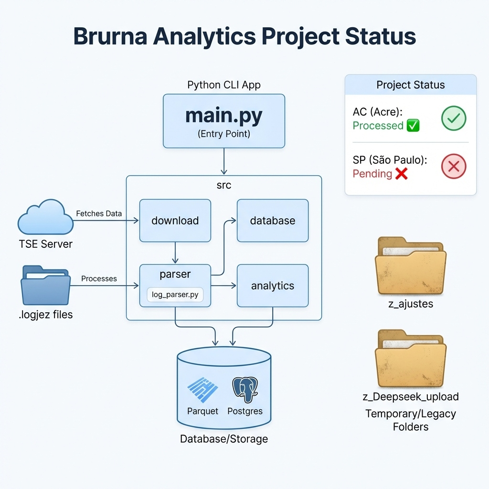
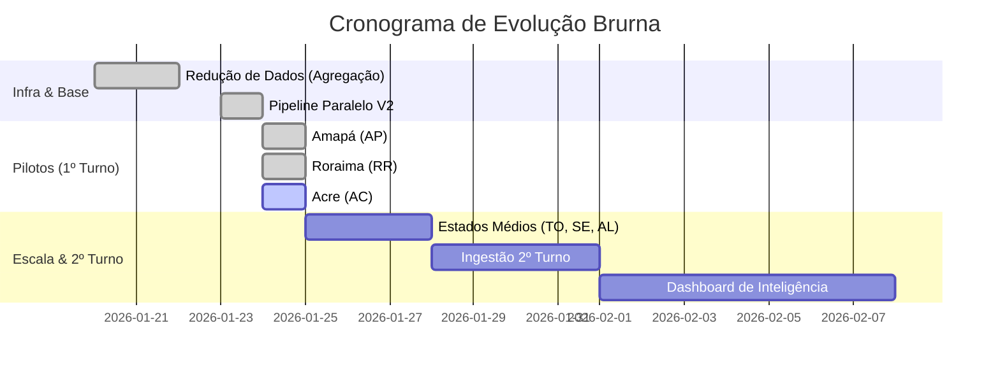

# Brurna Analytics 🗳️ 🇧🇷


**Brurna Analytics** é uma plataforma de auditoria forense de alta performance para o sistema eleitoral brasileiro. O projeto visa fornecer transparência e ferramentas analíticas avançadas para o processamento de logs das Urnas Eletrônicas (`logd.dat`), permitindo a identificação de padrões, detecção de anomalias e cruzamento com resultados oficiais do TSE.

---

## 🎯 Objetivos do Projeto

- **Transparência Pública**: Democratizar o acesso e a compreensão dos logs das urnas eletrônicas.
- **Auditoria Forense Automatizada**: Detectar automaticamente comportamentos inesperados ou falhas de integridade.
- **Otimização de Grande Escala**: Processar TBs de dados brutos com redução drástica de volume para análise em hardware comum.
- **Conformidade em Primeiro Lugar**: Garantir a total privacidade de dados sensíveis (CPFs e títulos) conforme a LGPD.

---

## 🏗️ Arquitetura e Fluxo de Dados

A estrutura do projeto segue um pipeline modular para garantir escalabilidade:



### Componentes Principais:
1.  **`main.py`**: O orquestrador central (CLI) para comandos de download, processamento e análise.
2.  **`src/download`**: Motor paralelo de alta performance (25+ threads) para ingestão direta dos servidores do TSE.
3.  **`src/parser`**: Núcleo de extração que lida com arquivos `.logjez` e normaliza os eventos brutos.
4.  **`src/analytics`**: Suíte forense (Detecção de Outliers, Padrões, e Cruzamento TSE).
5.  **`src/database`**: Camada de persistência otimizada (PostgreSQL + Parquet).

---

## 🚀 Funcionalidades Chave

*   **Motor de Agregação Inteligente**: Redução de **99.98%** no volume de dados através do reconhecimento de padrões de mensagens.
*   **Pipeline V2 (High-Performance)**: Otimizado para processadores modernos (testado com 28-32 cores), reduzindo o tempo de processamento nacional de semanas para dias.
*   **Detector de Anomalias Críticas**:
    *   **Privacy Guard**: Varredura automática por CPFs e PII.
    *   **Integrity Check**: Validação de encodings e assinaturas digitais.
*   **Relatórios Comparativos**: Gráficos automáticos de densidade temporal e fluxo de votação por UF/Modelo de Urna.

---

## 📊 Status Atual e Roadmap



### Progresso Detalhado

| UF | Status | Urnas | Anomalias Críticas |
| :--- | :---: | :---: | :---: |
| **Amapá (AP)** |  | 1.740 | 0 |
| **Roraima (RR)** |  | 1.268 | 0 |
| **Acre (AC)** |  | 2.124 | - |
| **Tocantins (TO)** |  | ~4.000 | - |

---

## 🛠️ Instalação Rápida

```bash
# Clone e Setup
git clone https://github.com/MarcosJRcwb/brurna-analytics.git
cd brurna-analytics
python -m venv .venv
# Ativar venv e instalar
pip install -r requirements.txt

# Executar Ingestão Turbo
python main.py download --uf ac
```

---

## 📄 Licença e Ética

Este projeto é destinado a fins de transparência e pesquisa. Licenciado sob **MIT**.
Todos os dados processados são públicos, fornecidos pelo TSE através do Portal de Dados Abertos.