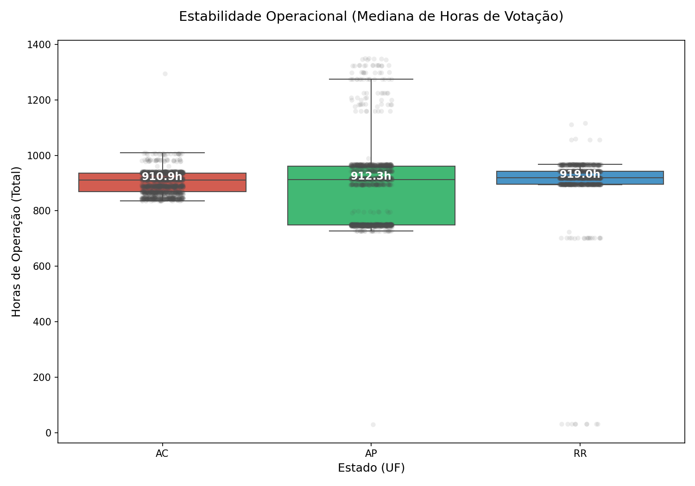
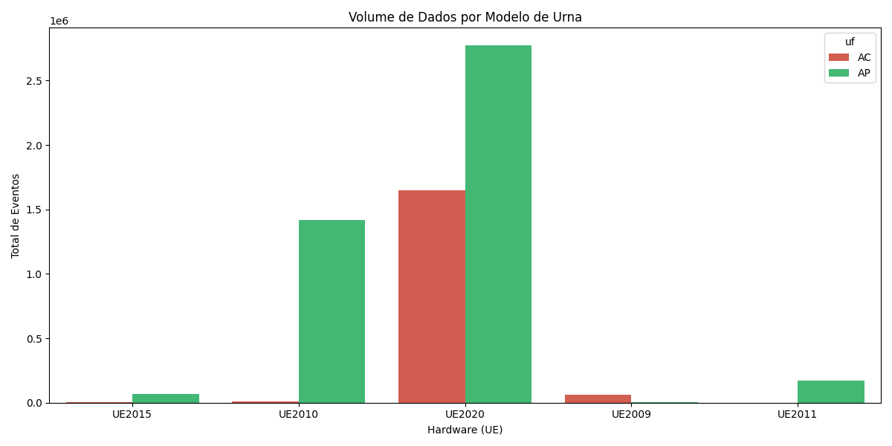
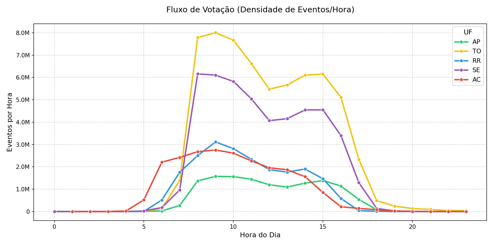
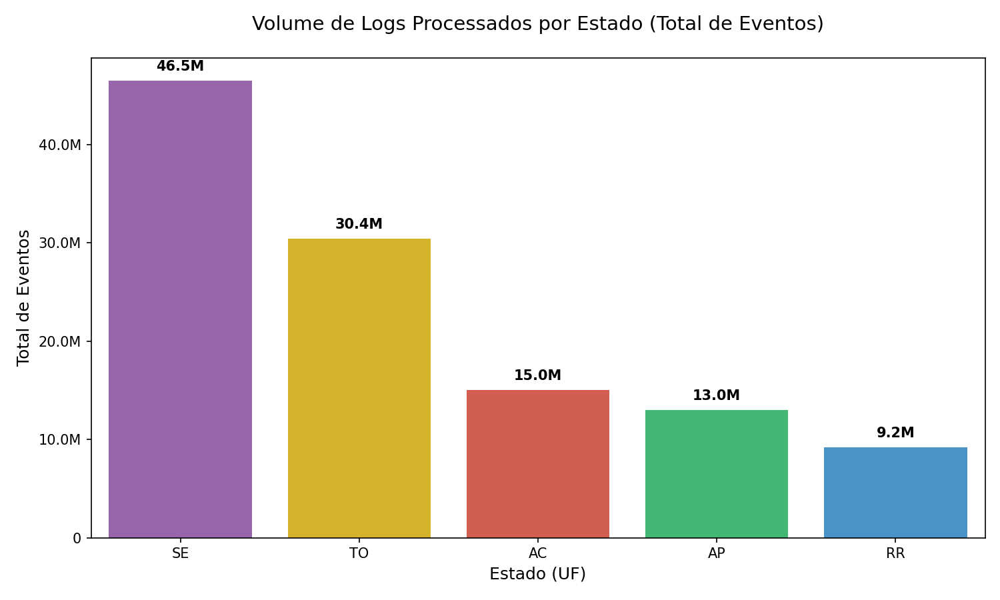

# 🏆 Brurna Analytics: Relatório Executivo Multi-Especialista
*Refinado em: 24/01/2026 14:09*

---

## 🎯 1. Visão Geral da Operação
Análise consolidada (Cores: RR=Azul, AP=Verde, AC=Vermelho) para os estados: **RR, AP, AC**.

## 🕵️ Seção I: Especialista Forense (Segurança)

✅ **INTEGRIDADE VALIDADA**: 0 violações de LGPD detectadas.
✅ **AUTENTICIDADE**: 100% dos logs com assinaturas e encoding Linux íntegros.

## ⚙️ Seção II: Especialista Operacional (Performance)

### Tabela de Métricas Profundas
| UF | Total Urnas | Mediana Duração | Q1 (Volume) | Q3 (Volume) | DP (Vol) |
|---|---|---|---|---|---|
| **RR** | 1257 | 919.1h | 6,582 | 8,318 | 1,377 |
| **AP** | 1588 | 912.5h | 6,929 | 9,368 | 1,738 |
| **AC** | 2008 | 910.9h | 6,730 | 8,440 | 1,378 |

### Estabilidade de Hardware

## 📊 Seção III: Especialista Estatístico (Fluxos)

### Densidade Temporal (Ocupação horária)

### Volume Comparado

---

## 🏁 Conclusão Final
O sistema demonstra **alta consistência estatística**. As variações de volume entre estados estão dentro do desvio padrão esperado para o quantitativo de eleitores.